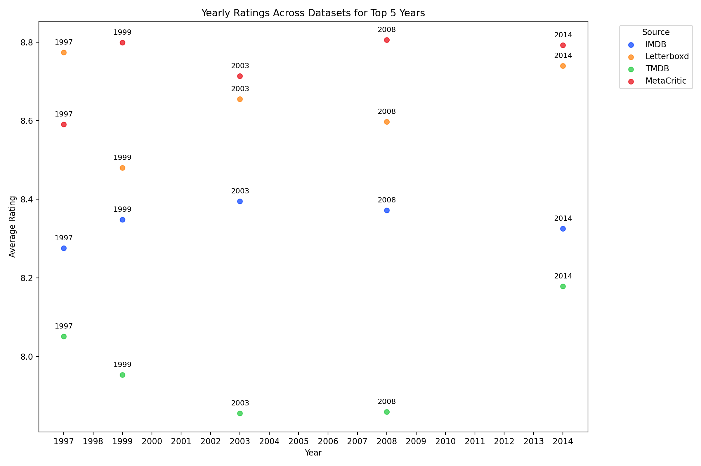

# Greatest Year in Film 🎥  

This project aims to uncover the **greatest year in film history**, using data from **IMDb**, **TMDb**, **Metacritic**, and **Letterboxd**. Additionally, the same methodology was applied exclusively to **Rotten Tomatoes** to analyze audience and critic ratings in depth. 
The analysis looks **individual years** and takes into account **3, 5, 7, and 10 best films by rating** for that year to identify trends and patterns.

## Data Sources  
- **IMDb**
- **TMDb** 
- **Metacritic**
- **Letterboxd**
- **Rotten Tomatoes**

## Objectives  
1. Identify the **greatest year in film history** by calculating the **average ratings** for the **top 3, 5, 7, and 10 best-rated movies** from each year across all sources.  
2. Perform a separate analysis with **Rotten Tomatoes** to compare results.  

## Results  
- **Greatest Year in Film (All Sources)**: *[2014]*  
- **Greatest Year Based on Rotten Tomatoes Critics Scores**: *[2018]*  
- **Greatest Year Based on Rotten Tomatoes Audience Scores**: *[1994]*  

## Visualizations  
- **Trends in Ratings for Top 20 Years**:  
  
- **Scatter plot for the Top 5 Years**:  
  
  
- **Rotten Tomatoes Analysis**:  
  - **Trends in Ratings for Top 20 Years**:  
  
  - **Scatter plot for the Top 5 Years**:  
  

## Conclusion  
By utilizing data from multiple platforms and comparing **critic** and **audience ratings**, this project provides a comprehensive perspective on the greatest years in film history. 
